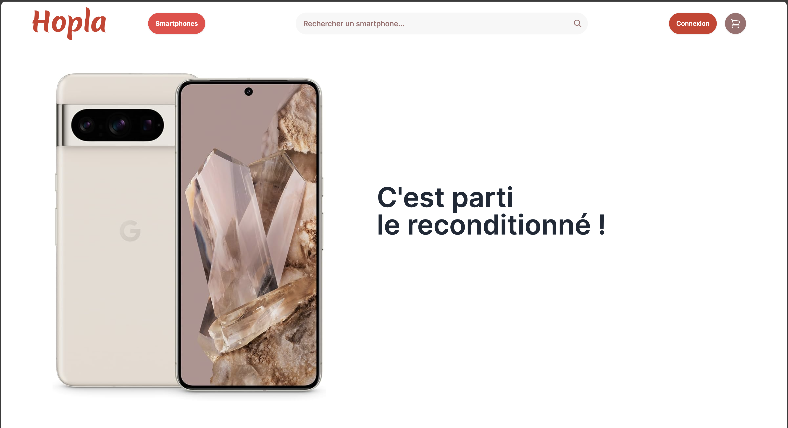
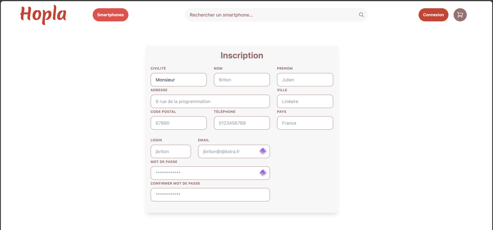

<h1 align="center">
  
</h1>

  📱 <strong>Bienvenue chez Hopla</strong>, le reconditionneur de smartphones made in Alsace ! 🌿

Nous sommes passionnés par la technologie durable et nous nous engageons à donner une seconde vie aux appareils mobiles. Chez Hopla, nous combinons expertise technique et engagement écologique pour offrir des smartphones reconditionnés de haute qualité à des prix abordables. Chaque appareil est rigoureusement testé et remis à neuf avec soin dans notre atelier alsacien 🏡. Rejoignez-nous dans notre mission de réduire l'empreinte électronique tout en bénéficiant de la technologie de pointe ! 💪♻️

## 🌐 Accueil

  

Découvrez notre interface d'accueil conviviale qui facilite votre navigation et votre accès à une technologie durable.

## 📝 Inscription

  

Rejoignez notre communauté en quelques clics. L'inscription est simple et rapide, ouvrant la porte à des offres exclusives et à la possibilité de contribuer à un environnement plus vert.

## 📱 Smartphones

  

Explorez notre vaste sélection de smartphones reconditionnés. Trouvez le téléphone qui correspond à vos besoins et à votre budget sans compromettre la qualité ou la performance.

